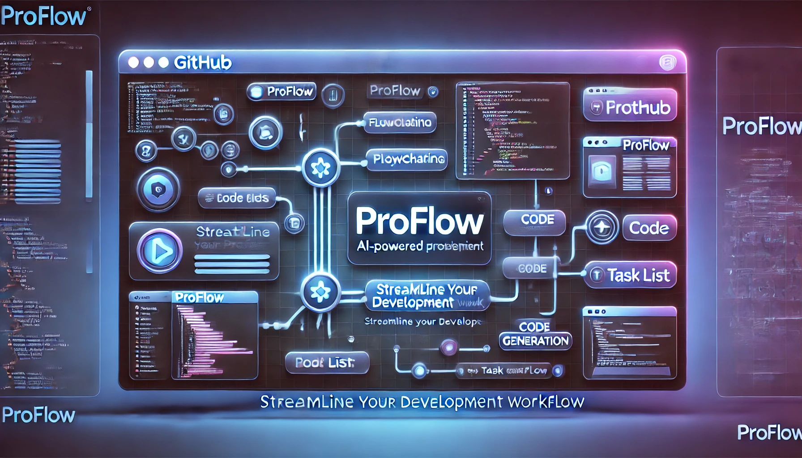

# ProFlow



ProFlow is an AI-powered project planning and code generation tool that helps developers streamline their development workflow. It allows users to describe their project idea, select a tech stack, and automatically generates features, implementation steps, and complete code.

## Features

- Project ideation and planning
- Tech stack selection
- AI-powered feature generation
- Step-by-step implementation planning
- Complete code generation
- Modern Next.js frontend

## How It Works

1. **Project Description**: Start by describing your project idea in plain English. ProFlow understands your requirements and helps shape your vision.

2. **Tech Stack Selection**: Choose from recommended technology stacks or specify your preferred technologies. ProFlow suggests optimal tech combinations based on your project needs.

3. **Feature Generation**: AI analyzes your project description and generates a comprehensive list of features, categorized by priority and complexity.

4. **Implementation Planning**: For each feature, ProFlow creates detailed implementation steps, breaking down complex tasks into manageable subtasks.

5. **Code Generation**: Generate production-ready code for your entire project, complete with best practices, documentation, and modern architecture patterns.

## Tech Stack

- **Frontend**:
  - Next.js 14 with App Router for server-side rendering and routing
  - TypeScript for type safety and better developer experience
  - Tailwind CSS for responsive and modern UI design
  - React Server Components for optimal performance

- **AI Integration**:
  - OpenAI GPT for intelligent code and feature generation
  - Stream-based responses for real-time code generation
  - Context-aware code suggestions

## Getting Started

1. Clone the repository
```bash
git clone https://github.com/Kylecam625/proflow.git
cd proflow
```

2. Install dependencies
```bash
cd frontend
npm install
```

3. Set up environment variables
Create a `.env.local` file in the frontend directory with:
```
OPENAI_API_KEY=your_api_key_here
```

4. Run the development server
```bash
npm run dev
```

Open [http://localhost:3000](http://localhost:3000) with your browser to see the result.

## Project Structure

```
frontend/
├── src/
│   ├── app/                 # Next.js app directory
│   │   ├── api/            # API routes for AI integration
│   │   ├── features/       # Feature generation UI
│   │   ├── tasks/          # Task management interface
│   │   └── code-viewer/    # Code preview component
│   └── components/         # Reusable React components
├── public/                 # Static assets
└── package.json           # Project dependencies
```

## API Routes

- `/api/generate-features`: Generates project features from description
- `/api/generate-steps`: Creates implementation steps for features
- `/api/generate-code`: Produces code for specific features
- `/api/generate-full-code`: Generates complete project codebase
- `/api/ask-code-question`: Answers questions about generated code

## Contributing

We welcome contributions! Please follow these steps:

1. Fork the repository
2. Create a feature branch (`git checkout -b feature/amazing-feature`)
3. Commit your changes (`git commit -m 'Add amazing feature'`)
4. Push to the branch (`git push origin feature/amazing-feature`)
5. Open a Pull Request

## License

MIT

## Support

If you encounter any issues or have questions:
- Open an issue on GitHub
- Check existing issues for solutions
- Review the documentation 